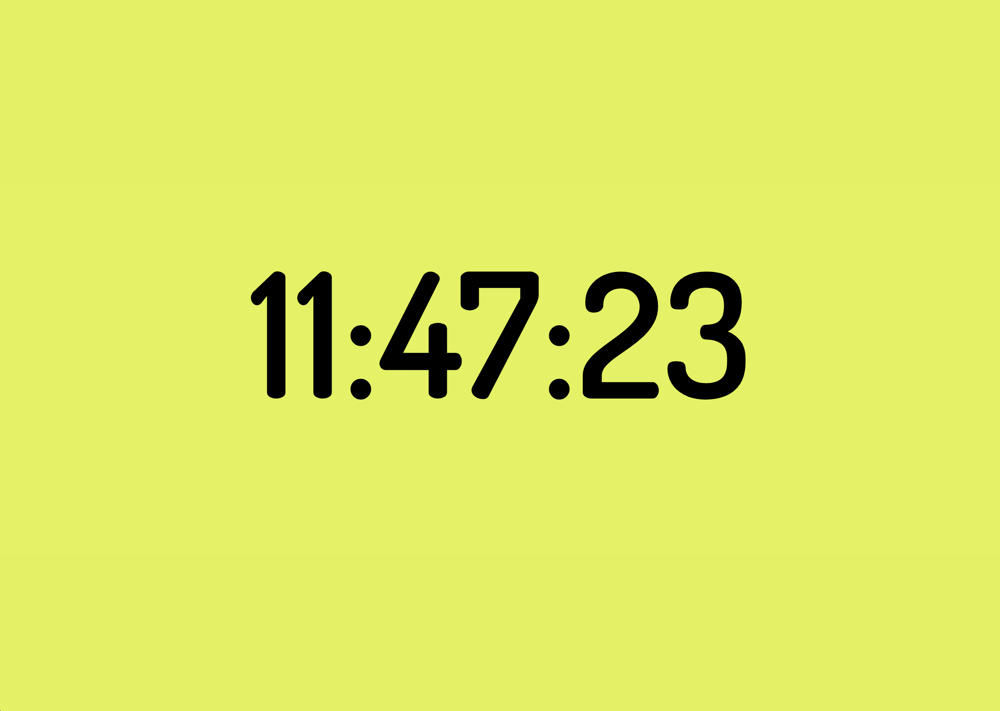

# ANCAP Screensaver v1.1 🟡⚫

**Screensaver Libertario para macOS con 192 frases optimizadas**

## 📋 Características

- **192 frases libertarias** optimizadas (máximo 18 palabras cada una)
- **Efectos glitch ultra-violentos** con duración de 0.2 segundos
- **Tipografía Space Grotesk** profesional y moderna
- **Soporte bilingüe** (Español/Inglés automático)
- **Controles manuales** para navegación interactiva
- **Colores libertarios** dorado sobre negro
- **Sin overflow** - todas las frases caben perfectamente en pantalla

## Installation

### Download and Install

1. **Download** the latest release from [GitHub Releases](https://github.com/monarch-one/monarch/releases)
2. **Unzip** the downloaded file
3. **Double-click** on `ANCAP.saver` 
4. **Choose** "Install for this user only" when prompted
5. **Open** System Preferences > Desktop & Screen Saver
6. **Select** "ANCAP" from the list

### Manual Installation

If double-clicking doesn't work:

1. Copy `ANCAP.saver` to `~/Library/Screen Savers/`
2. Open System Preferences > Desktop & Screen Saver
3. Select "ANCAP" from the screensaver list

## Requirements

- macOS 10.12 or later
- 64-bit Intel or Apple Silicon Mac

## Uninstallation

1. Go to `~/Library/Screen Savers/`
2. Delete `ANCAP.saver`
3. Open System Preferences to refresh the list

## Development

This screensaver is built using:
- HTML/CSS/JavaScript for the visual content
- Native macOS screensaver framework
- WebKit rendering engine

## License

Open source project. Feel free to modify and distribute.

## Author

Created by [monarch-one](https://github.com/monarch-one)

---

*Anarcho-capitalism: voluntary exchange and individual freedom* 🟡⚫
